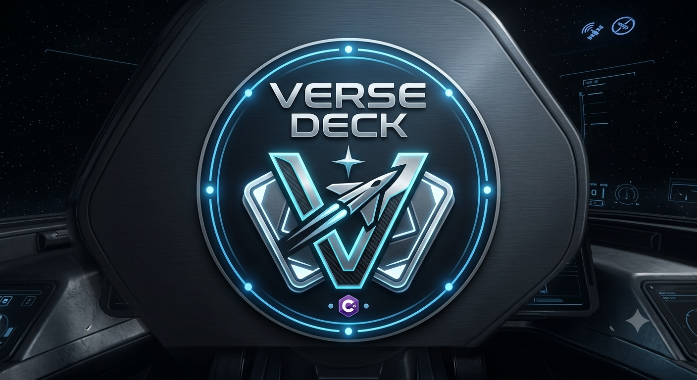

<p align="center">
  
</p>

# VerseDeck Companion

Botonera companion para Windows inspirada en Star Citizen, con controles manuales, voz local Push-to-Talk y panel movil LAN.

Autor: **Zowix**
Docu: https://verse-page.vercel.app/
Tutorial: https://www.youtube.com/watch?v=zvlNAomh1F4

## Source code

```powershell
dotnet build VerseDeck.slnx
dotnet run --project src/VerseDeck.App/VerseDeck.App.csproj
```

## Legal

VerseDeck Companion es una aplicacion fan no oficial. No esta afiliada a Cloud Imperium Games, Roberts Space Industries ni Star Citizen.
