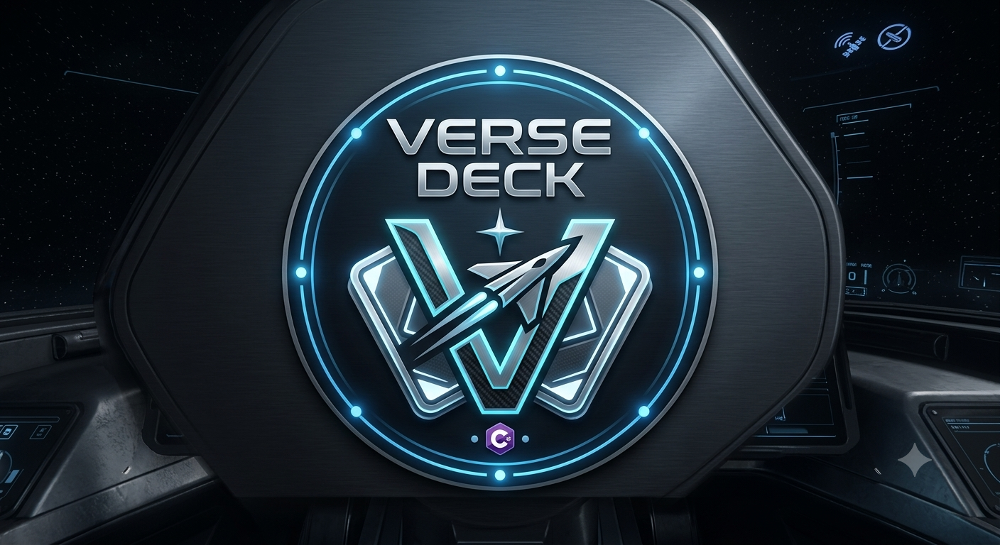

<p align="center">
  
</p>

# VerseDeck Companion

Botonera companion para Windows inspirada en Star Citizen, con controles manuales, voz local Push-to-Talk y panel movil LAN.

Docu: https://verse-page.vercel.app/


Tutorial: https://www.youtube.com/watch?v=zvlNAomh1F4

## Source code

```powershell
dotnet build VerseDeck.slnx
dotnet test tests/VerseDeck.Tests
dotnet run --project src/VerseDeck.App/VerseDeck.App.csproj
```

Para probar sin tocar tu deck real, apunta la app a una carpeta de datos desechable:

```powershell
$env:VERSEDECK_DATA_DIR = "C:\temp\versedeck-pruebas"
dotnet run --project src/VerseDeck.App/VerseDeck.App.csproj
```

## Temas

El tema cambia solo segun el fabricante de la nave del perfil activo: **Drake**, **Origin**, **Aegis**, **Anvil**, **Gatac** (violeta Xi'an, como la Syulen), **RSI**, **MISC**, **Crusader**, **Esperia** y **Banu**. Cualquier otra nave usa **Neutral**. En Ajustes se puede fijar un tema concreto.

- La lista de naves del perfil trae 187 naves pilotables agrupadas por fabricante; el campo sigue siendo editable.
- **Animaciones**: un neon que respira junto a la seccion activa y bajo la cabecera. Va a 20 fotogramas por segundo y se para del todo con la ventana minimizada o sin foco, es decir, mientras juegas. Medido: menos del 2 % de un nucleo con la ventana delante, 0 con el juego delante. Se apaga en Ajustes.
- Destellos que solo cuestan cuando pasa algo: un anillo de neon en el modulo que se acaba de enviar y un parpadeo del indicador VOZ cada vez que el microfono reconoce una frase.

## Controles

VerseDeck lee `actionmaps.xml` de tu perfil de Star Citizen y usa tu tecla en los modulos vinculados a una accion del juego. Si cambias un bind en el juego, el modulo se actualiza solo.

- Solo lectura: nunca escribe en la carpeta del juego ni abre `Data.p4k`.
- El juego solo guarda lo que has cambiado. Para lo demas se usa un catalogo propio de teclas por defecto, valido para la version **4.10**; tras un parche puede dejar de coincidir.
- Los nombres internos de las acciones del catalogo vienen de documentacion comunitaria y no estan verificados contra el juego. Si un modulo vinculado ignora tu rebind, vinculalo a la accion tal como aparece en "Tus rebinds".
- Las acciones que piden mantener la tecla (autodestruccion, modo maestro y quantum con B, aterrizaje automatico) se envian como una sola pulsacion larga, de 2 segundos como maximo. En los modulos con tecla manual, el campo MANTENER del editor elige toque o 0,5 a 2 segundos.
- No se envian botones de raton, mando o joystick ni dobles pulsaciones.
- El catalogo tiene 56 acciones agrupadas (Vuelo, Aterrizaje, Energia, Sistemas, Operador, Objetivos, Defensa, Interfaz, A pie). Las teclas por defecto se han cruzado entre dos guias publicas de 4.10; cuando no coinciden, la accion queda sin tecla por defecto en vez de arriesgar una pulsacion equivocada. No se leen los archivos internos del juego para no rozar el EULA.

### Control de trafico

Dos modulos, **Hangar Request** ("pedir hangar", "solicitar aterrizaje") y **Takeoff Request** ("pedir despegue", "pedir salida"), envian la unica tecla de permiso del juego (LAlt+N por defecto, o la tuya al vincularlos). Es un dialogo a dos voces: tu copiloto pide ("Syulen a control: solicitamos salida") y la torre contesta por radio ("Syulen, aqui control..."). La torre usa otra voz instalada si la hay, y siempre un efecto de radio (banda de comunicaciones, ruido y clic de canal) generado una vez y guardado. Si das otra orden entre medias, la torre no interrumpe. Sin leer la memoria del juego no puede saber si te han asignado hangar o si se han abierto las puertas, asi que confirma que la peticion salio, nunca lo que paso dentro del juego.

## Copiloto

Una voz neuronal que confirma tus ordenes. Se genera en tu PC con [sherpa-onnx](https://github.com/k2-fsa/sherpa-onnx); no usa servicios en linea ni de pago.

- Las voces no vienen con la aplicacion. En la seccion Copiloto, DESCARGAR baja el modelo elegido desde la publicacion de sherpa-onnx en GitHub, comprueba su SHA-256 y lo guarda en `%AppData%\VerseDeck Companion\voices`. Es la unica conexion a internet de esta funcion.
- Voces en español: Piper davefx (datos CC0), Piper sharvard (datos CC BY 3.0, Universidad de Edimburgo), Piper claude (Apache 2.0) y Kokoro (Apache 2.0).
- Cada frase se genera una vez y se guarda; despues suena al instante.
- Interruptores: general, SILENCIO en la cabecera, solo comandos de voz, por categoria y por modulo (frase de la personalidad, texto propio o ninguna).
- Las frases confirman la orden, no el estado de la nave: VerseDeck sabe que envio la tecla, nada mas.
- Un modulo vinculado a una accion sin tecla en el juego ya no envia la tecla que tenia antes: avisa y no envia nada, tambien desde el telefono.
- Mientras el copiloto habla, lo que oiga el microfono se descarta: su propia voz no puede disparar un comando.
- El copiloto contesta a los clics del deck y a los comandos de voz. Los toques desde el panel movil no se contestan.

Licencias de lo que usa esta funcion: sherpa-onnx (Apache 2.0), ONNX Runtime (MIT) y SharpCompress (MIT). Los modelos de voz y los binarios de sherpa-onnx incluyen datos y codigo de eSpeak NG, que se publica bajo GPL 3.0; tenlo en cuenta si redistribuyes la aplicacion.

## Reconocimiento de voz

Usa el reconocedor de Windows en español, sin descargas. Junto a tus frases escucha tambien "habla libre": si lo que oye suena a conversacion, no ejecuta nada. En una prueba con voces sinteticas, ninguna de 21 frases de conversacion se tomo por un comando.

- **Probar frase** (editor de modulo) y **Revisar todas** (seccion Voz): la voz del copiloto dice tus frases y el reconocedor las escucha sin microfono. Avisa de las que se confunden con otro modulo o no se entienden. Necesita una voz del copiloto instalada y solo trabaja mientras lo pides.
- **Ultimo que ha oido** (seccion Voz): las 20 ultimas frases reconocidas y por que se ejecutaron o no.
- Las frases en ingles se reconocen peor con el reconocedor español; si una da problemas, cambiala por una en español.

## A bordo

Checklists, temporizadores y bitacora, por voz o con el raton. No necesitan el juego y no trabajan en reposo.

- **Checklists**: "checklist prevuelo" la empieza; "hecho", "siguiente" o "listo" completa el paso. Si el paso tiene modulo, "hecho" envia esa unica pulsacion; si el modulo falla, el paso no avanza. "Saltar", "repetir" y "cancelar checklist" hacen lo que dicen. Vienen dos de ejemplo, Prevuelo y Aterrizaje, que puedes cambiar o borrar.
- **Temporizadores**: "avisame en diez minutos" o, con etiqueta, "refineria treinta minutos" (tambien reclamacion, hangar, carga, combustible, mision y descanso). Por voz: de 1 a 15, y 20, 25, 30, 40, 45, 50, 60, 90 y 120. Desde la pantalla, cualquier cantidad. El copiloto avisa en voz alta; si esta apagado, suena el pitido.
- **Bitacora**: "anota" y lo que quieras recordar. Guarda la hora, el perfil y la nave, y se exporta a un .txt en Documentos. El dictado de Windows falla con nombres propios: revisa la nota en pantalla.

Las frases del copiloto para checklists y temporizadores sin etiqueta se generan de antemano, como las de los modulos. Si hay que generar una al momento, el modelo de voz se libera a los 30 segundos.

## Panel movil

El servidor solo responde dentro de la red local. El telefono se empareja escribiendo el PIN que muestra la app; sin emparejar no puede listar ni pulsar modulos.

## Limites que el proyecto se impone

- Un clic, un toque o una frase envia como maximo una pulsacion de tecla.
- Sin secuencias, bucles ni auto-repeticion.
- Sin lectura de memoria, inyeccion, hooks ni interceptacion de red.

Estas reglas buscan mantenerse lejos de lo que el TOS de RSI prohibe (programas "auto" y "macro"). No son una aprobacion de Cloud Imperium Games: CIG no publica una lista de herramientas permitidas.

## Tipografias

Barlow, Barlow Condensed y JetBrains Mono, bajo SIL Open Font License. Las licencias estan en `src/VerseDeck.App/Fonts`.

## Legal

VerseDeck Companion es una aplicacion fan no oficial. No esta afiliada a Cloud Imperium Games, Roberts Space Industries ni Star Citizen.
